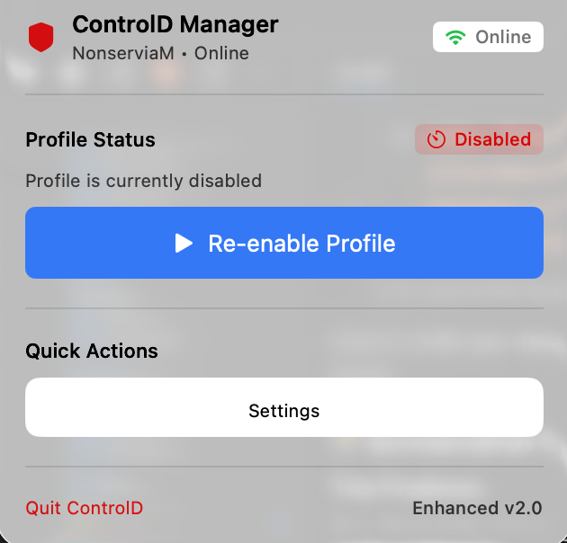

# ControlD MenuBar

A sleek macOS menu bar application for managing ControlD profiles and DNS filtering through the ControlD API. Website [Here](https://pencarsa.github.io/controldmanager-site/)

## 🚀 Features

- **Menu Bar Integration**: Quick access from your macOS menu bar
- **Secure API Management**: Safe keychain storage for API tokens
- **Profile Management**: Easy switching between ControlD profiles  
- **One-Click Disable**: Temporarily disable profiles for 1 hour
- **Smart UI**: Scalable interface that handles large numbers of profiles
- **Auto-Validation**: Real-time API key validation and error handling
- **Modern Design**: Clean, native macOS interface with smooth animations

## 📋 Requirements

- macOS 11.0 Big Sur or later
- ControlD account with API access
- Xcode 13+ (for building from source)

## 📦 Installation

### Quick Install
```bash
git clone https://github.com/yourusername/controld-menubar.git
cd controld-menubar
./install_simple.sh
```

### Manual Build
```bash
# Clone repository
git clone https://github.com/yourusername/controld-menubar.git
cd controld-menubar

# Build application
./build.sh

# Install to Applications
cp -r "./ControlDMenuBar/build/Build/Products/Release/ControlD.app" /Applications/
```

## 🔑 Setup

1. **Get Your API Token**:
   - Log into [ControlD Dashboard](https://controld.com/dashboard)
   - Navigate to **Account Settings** → **API**
   - Generate a new API token

2. **Configure the App**:
   - Launch ControlD from your menu bar
   - Click **Configure Settings**
   - Enter your API token
   - Select your desired profile

## 🎯 Usage

### Basic Operations
- **Click menu bar icon**: Open control panel
- **Disable Profile**: Click "Disable Profile for 1 Hour"  
- **Re-enable**: Click "Re-enable Profile" (if disabled)
- **Settings**: Configure API key and select profiles

### Profile Management
- **Auto-Discovery**: Profiles load automatically after API validation
- **Search**: Find profiles quickly in large lists
- **Status Indicators**: See which profiles are currently disabled
- **One-Click Selection**: Easy profile switching

## 🛡️ Security Features

- **Keychain Integration**: API tokens stored securely in macOS Keychain
- **Certificate Validation**: HTTPS certificate pinning for API calls
- **Token Validation**: Real-time API key format and connectivity validation
- **Timeout Protection**: Network request timeouts prevent hanging
- **Memory Safety**: Secure token handling with automatic cleanup

## 🏗️ Architecture

Built with modern Swift practices:
- **SwiftUI**: Native macOS interface
- **Combine**: Reactive programming for real-time updates
- **URLSession**: Secure networking with custom configuration
- **Keychain Services**: Encrypted credential storage
- **UserDefaults**: Non-sensitive setting persistence

## 📁 Project Structure

```
controld-menubar/
├── ControlDMenuBar/
│   ├── ControlDMenuBar.xcodeproj/
│   └── ControlDMenuBar/
│       ├── ContentView.swift         # Main UI
│       ├── SettingsView.swift        # Settings interface  
│       ├── MenuBarController.swift   # Business logic
│       ├── ControlDService.swift     # API client
│       ├── SettingsManager.swift     # Configuration
│       └── Info.plist               # App metadata
├── build.sh                         # Build automation
├── install_simple.sh               # Easy installer
└── .gitignore                      # Git exclusions
```

## 🔨 Development

### Prerequisites
```bash
# Required tools
xcode-select --install
```

### Building
```bash
# Clean build
./build.sh

# Development build  
xcodebuild -project ControlDMenuBar/ControlDMenuBar.xcodeproj -scheme ControlDMenuBar -configuration Debug
```

### Code Style
- Swift 5.5+ with modern concurrency
- SwiftUI for all interface components
- Protocol-oriented design patterns
- Comprehensive error handling

## 🤝 Contributing

1. **Fork** the repository
2. **Create** a feature branch (`git checkout -b feature/amazing-feature`)
3. **Commit** your changes (`git commit -m 'Add amazing feature'`)
4. **Push** to the branch (`git push origin feature/amazing-feature`)
5. **Open** a Pull Request

### Guidelines
- Follow Swift style guidelines
- Add tests for new functionality
- Update documentation as needed
- Ensure security best practices

## 📄 License

This project is licensed under the MIT License - see the [LICENSE](LICENSE) file for details.

## 🆘 Support

### Getting Help
- **Issues**: [GitHub Issues](https://github.com/yourusername/controld-menubar/issues)
- **Discussions**: [GitHub Discussions](https://github.com/yourusername/controld-menubar/discussions)
- **ControlD API**: [ControlD Support](https://controld.com/support)

### Troubleshooting

| Issue | Solution |
|-------|----------|
| Invalid API Token | Verify token in ControlD dashboard |
| No Profiles Loading | Check internet connection and API permissions |
| App Won't Launch | Ensure macOS 11.0+ and try rebuilding |
| Settings Won't Save | Check Keychain access permissions |

## 🎨 Screenshots

### Main Interface


*The ControlD Manager interface showing profile status and quick actions*

**Interface Features:**
- 🟢 **Online Status**: Real-time connection indicator  
- 👤 **Profile Display**: Current active profile (NonserviaM)
- 🔴 **Status Badge**: Clear disabled/enabled state indication
- 🔵 **Re-enable Button**: One-click profile reactivation
- ⚙️ **Settings Access**: Easy configuration management
- 📱 **Version Info**: Enhanced v2.0 indicator

## ⭐ Acknowledgments

- [ControlD](https://controld.com) for the powerful DNS filtering API
- The Swift community for excellent development tools
- Contributors who help improve this project

---

**Made with ❤️ for the macOS community**
